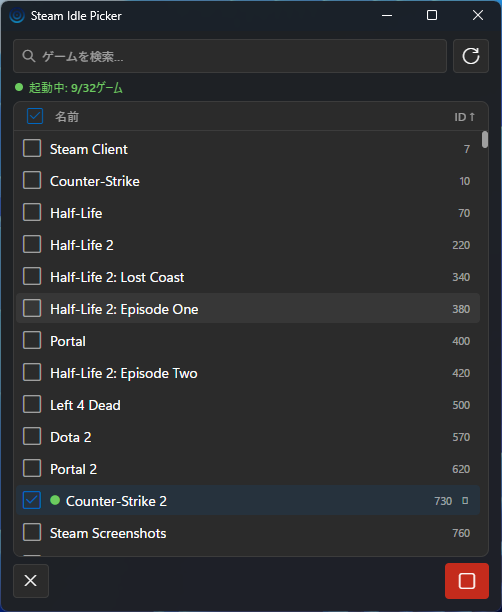

# Steam Idle Picker

A Windows desktop app that keeps selected Steam games in a "running" state simultaneously.



## Requirements

- Windows 10/11 (x64)
- Steam (must be running)

## Usage

1. Launch `Steam Idle Picker.exe`
2. Click the refresh button to load your game list
3. Check the games you want to idle (up to 32)
4. Click the play button — Steam will show them as "Playing"
5. Click the stop button to stop

## Notes

- Language (English / Japanese) and theme (Dark / Light) are detected automatically from Windows settings
- The sort header accepts clicks to sort by idle status, name, or ID

## Development

Built with [Tauri 2](https://tauri.app) (Rust) + React/TypeScript. See
[docs/TAURI_REWRITE_SPEC.md](docs/TAURI_REWRITE_SPEC.md) for the architecture.

```bash
npm install
npm run tauri dev    # run in dev mode
npm run tauri build  # produce a release build + NSIS installer
```
