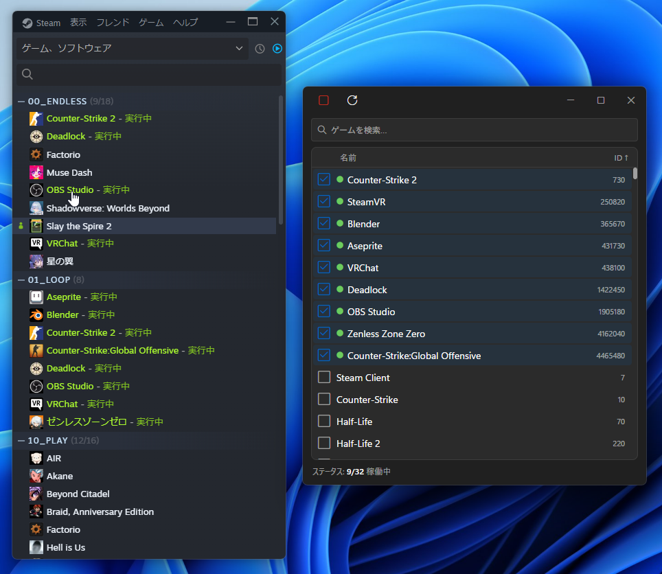

# Steam Idle Picker

A Windows desktop app that keeps selected Steam games in a "running" state simultaneously.



## Requirements

- Windows 10/11 (x64)
- Steam (must be running)

## Usage

1. Launch `Steam Idle Picker.exe`
2. Click the refresh button in the header to load your game list
3. Check the games you want to idle (up to 32) — checked games stay pinned to the top of the list
4. Click the play button — Steam will show them as "Playing"
5. Click the same button (now a stop icon) to stop all idling
6. Uncheck a game to stop idling it individually

The status footer always shows how many games are currently idling out of the 32 max.

## Notes

- Language (English / Japanese) and theme (Dark / Light) are detected automatically from Windows settings
- Click "Name" or "AppID" in the list header to sort; click again to reverse
- The title bar is custom-drawn (no native Windows chrome) — drag it to move the window, and use the minimize/maximize/close buttons on the right

## Development

Built with [Tauri 2](https://tauri.app) (Rust) + React/TypeScript.

```bash
npm install
npm run tauri dev    # run in dev mode
npm run tauri build  # produce a release build + NSIS installer
```
