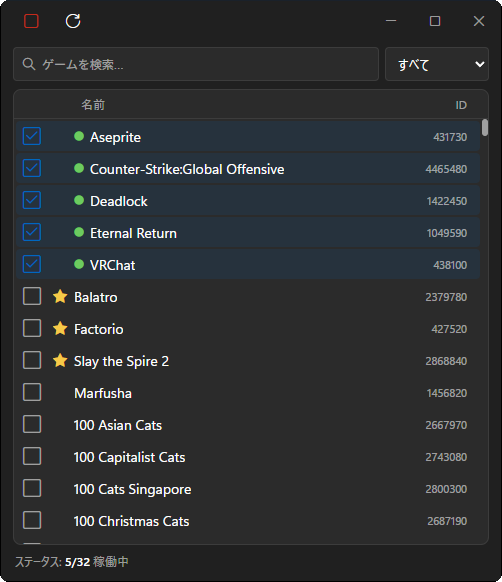

# Steam Idle Picker

Keep selected Steam games running simultaneously.

## Features

- Idle up to 32 games at once
- Search, favorites, filters and sorting
- Idling stops with the app, even if it crashes

## Getting Started

Requires Windows 10/11 and Steam running.

1. Launch `Steam Idle Picker.exe`
2. Click the refresh button to load your games
3. Check the games you want to idle
4. Click the play button
